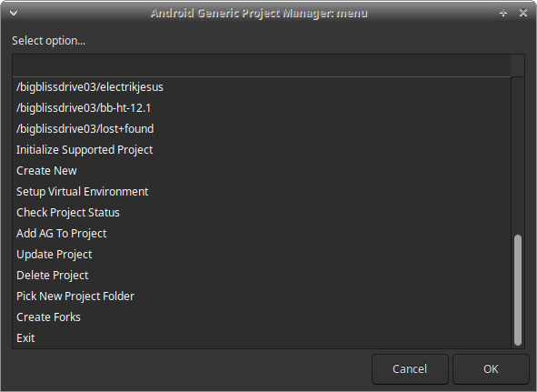
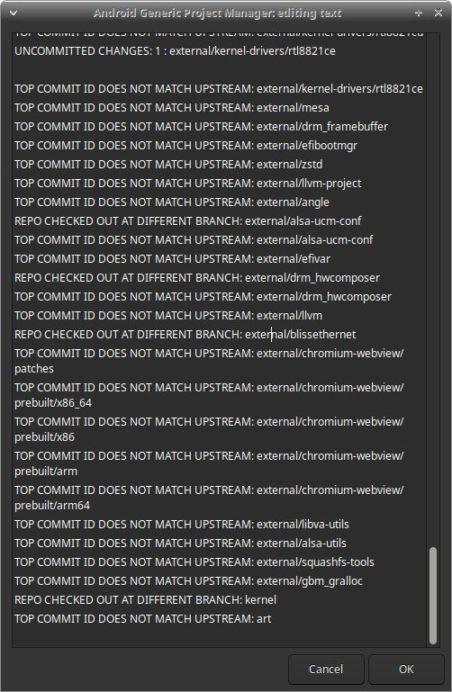

# Android-Generic Project Manager

## What Is This?

Android-Generic Project Manager (AGPM), is a tool that makes it easier to build and configure AOSP based projects. 

AGPM provides a number of features that can help you save time and effort, including:
 - Will check for missing dependencies and ask to install any missing. 
 - Automatic repo init: AGPM can automatically initialize a new AOSP project or update an existing one.
 - Python virtualenv support: AGPM can wrap your project in a Python virtualenv, which allows you to install packages and run scripts without affecting the rest of your system.
 - Update checking: AGPM can check for updates to your project's repositories and notify you of any changes.
 - Private project modules: You can add your private project modules to private_projects/api-##/* and they will be loaded into the list.
 - Much More

AGPM is designed to be flexible and extensible, so you can add your own project configurations and features. 

Currently, we support the following projects:
 - AOSP
 - Bliss ROM
 - Lineage OS
 - Bliss OS
 - Your Private Projects

We have a planned features list a mile long, and we are always working to add support for more projects. If you have any feedback or suggestions, please feel free to open an issue our repository.

## How Does It Work?

Using AGPM is pretty simple. It's using Bash mostly, and is able to use TTY or GUI, depending on if it finds a wm. So let's start with the basics. 

### Installing:

To install it, just clone the repo or download the .zip, and extract in a safe space reserved for development. Example:

`git clone --recurse-submodules https://github.com/android-generic/ag-project-manager ~/dev-stuff/agpm`

### Running:

To run the project, open a terminal launch the main project script. Example:

`bash ~/dev-stuff/agpm/ag-project-manager.sh`

Or with Debugging feedback enabled: 

`bash ~/dev-stuff/agpm/ag-project-manager.sh -d`

## Options:

AGPM comes with a number of initial options: 

- **Initialize Supported Project**: Clones the manifest, synces the repo, etc.
- **Create New**: Create a new AOSP based project
- **Setup Virtual Environment**: Sets up an existing project to use a Python virtual environment
- **Check Project Status**: Checks on a given projects existing status, and reports what is uncommitted, unpushed, etc. See screenshot of results when complete:
	
- **Add AG To Project**: This will add Android-Generic to the target project
- **Update Project**: Updates target project
- **Delete Project**: Deletes target project
- **Pick New Project Folder**: Lets you select a different project folder (handy for multiple drives)
- **Create Forks**: Forks an existing project to a git destination

## Contributions, Conduct & Licensing

Just keeping it simple. 

- [Code of Conduct](CODE_OF_CONDUCT.md)
- [Contributing](CONTRIBUTING.md)
- [License](LICENSE.md)
- [V2.2](VERSION.md)
